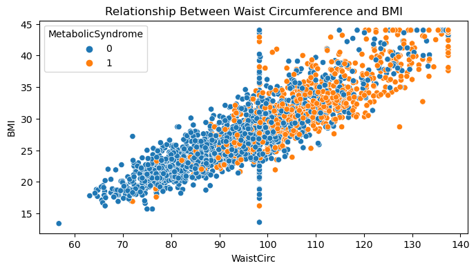
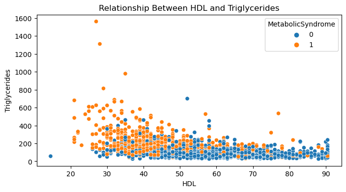

# Metabolic Syndrome
## Using Python and Machine Learning to predict disease
**Raymond Garcia**

Metabolic syndrome is a clustering of atleast three of the 5 following conditions: abdominal obesity, high blood pressure, high blood sugar, high triglycerides, low high density lipoprotein. Metabolic Syndrome can lead to serious complications such as cardiovascular disease, stroke, kidney disease, type 2 diabetes, and non alcoholic fatty liver disease. It is important to know the signs of Metabolic Syndrome and catch them early so proper interventions can be implemented. 

This project explores a dataset of patients, looking for trends in their bio markers, and ultimately trying to predict metabolic syndrome using machine learning. 

# Dataset
* This dataset is sourced from [data.world](https://data.world/informatics-edu/metabolic-syndrome-prediction), and was gathered from the [NHANES](https://www.cdc.gov/nchs/nhanes/index.htm) initiative
* The dataset has a variety of features for a patient that could possibly be used to predict Metabolic Syndrome.
* The target is Metabolic Syndrome, with our positive class (1) being MetSyn and our negative class (0) being No Metsyn. It is a classification problem
* The dataset has 13 Columns and 2401 Records. Each record represents a person and their corresponding bio markers. 

# Data Analysis
Before jumping into predictive analysis, I first did an exploratory and explanatory data analysis. My goal with this analysis was to understand my dataset and find trends that would be helpful in machine learning. I also learned about empty values and the best way to impute them, and about outliers in the dataset. WaistCirc, BMI, UricAcid, BloodGlucose, and HDL all had outliers that needed to be fixed. 
## Findings
> BMI And WaistCirc had a strong positive correlation. When combined, they also appeared to have a strong correlation with Metabolic Syndrome.



> HDL and Triglycerides had a weak negative correlation. And from the graph below, people with higher HDL and lower Triglycerides had a lower rate of Metabolic Syndrome.



# Machine Learning

* For this dataset, I fit 4 different models to the dataset, and optimized their hyperparameters using GridSearchCV. GridSearch is a great tool for automating hyperparameter testing, but it is compute expensive for very complicated models. 
* Because I had an imbalanced target, where the distribution of positive and negative Metabolic Syndrome was about 35/65, I used SMOTE to balance out the classes. 
* When choosing the best model, I chose to use Recall and Accuracy for my most important metrics. Recall is punished by large amounts of false negatives, which I want to reduce in my predictions. I prefer to misdiagnose someone with Metabolic Syndrome than fail to diagnose them and have them go untreated. 

I chose to use:
* Logistic Regression
* Random Forest Classifier
* LightGBM Classifier
* LightGBM with PCA and Feature Engineering

## Model Evaluation
**All metrics below are from the Testing Dataset.**
* Logistic Regression
    * Accuracy: ```.8236```
    * Recall: ```.7816```
    * Precision: ```.7252```
    * F1: ```.7523```
    * AUC: ```.90```
* Random Forest Classifier
    * Accuracy: ```.8902```
    * Recall: ```.8738```
    * Precision: ```.8182```
    * F1: ```.8451```
    * AUC: ```.96```
* LightGBM Classifier
    * Accuracy: ```.8885```
    * Recall: ```.8786```
    * Precision: ```.8117```
    * F1: ```.8438```
    * AUC: ```.97```
* LightGBM Classifier with PCA and Feature Engineering
    * Accuracy: ```.8536```
    * Recall: ```.8431```
    * Precision: ```.7544```
    * F1: ```.7963```
    * AUC: ```.92```

**Notes**
> Logistic Regression was not a good fit for this dataset. LightGBM was the best model after tuning. Using PCA and Feature Engineering lost too much information and was detrimental to our scores. RandomForest produced a strong model as well, but it was slightly worse at Recall, which was our main metric for model performance. 

## Best Model

The best model was the LightGBM with the following Hyperparameters:
* Max Depth: ```4```
* Number of Estimators: ```200```
* Lambda Regularization: ```20```

This model would accurately predict about 89% of cases using the bio markers provided, and it minimizes false negatives.

# Final Recommendations
* Implement the LightGBM model at the time of inputting the recorded bio markers into the system to predict metabolic syndrome
* Work with patients who have a high BMI and WaistCirc to make lifestyle changes and reduce their odds of developing Metabolic Syndrome. 
